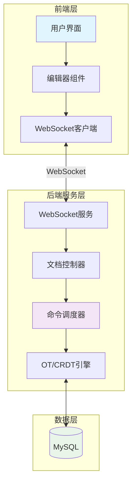
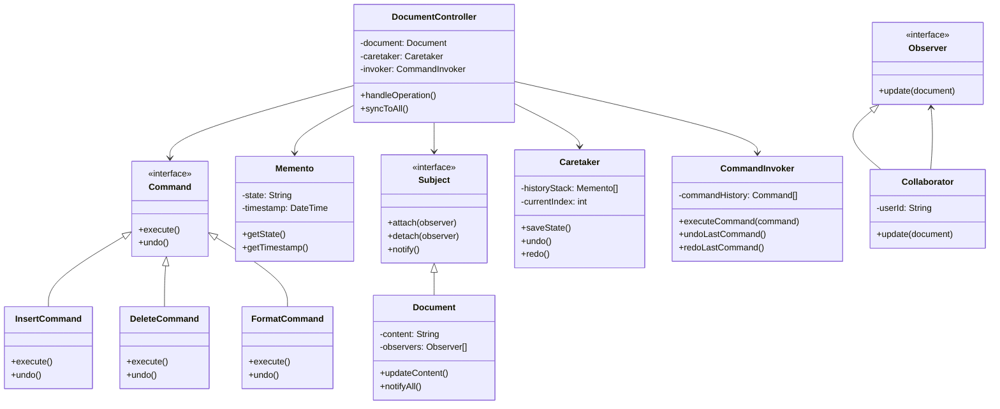
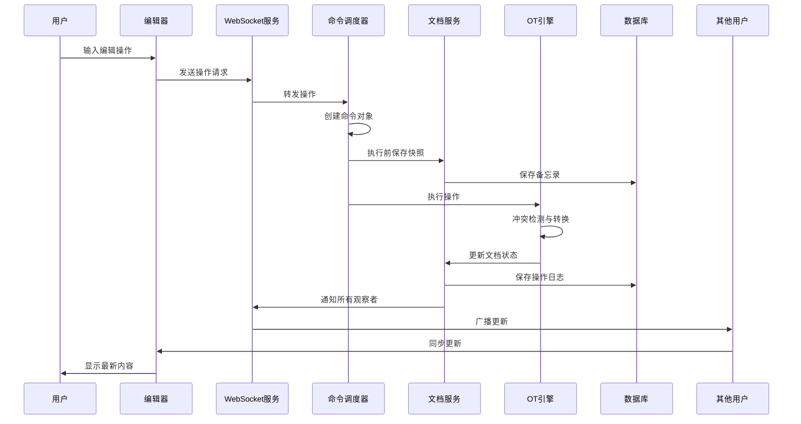
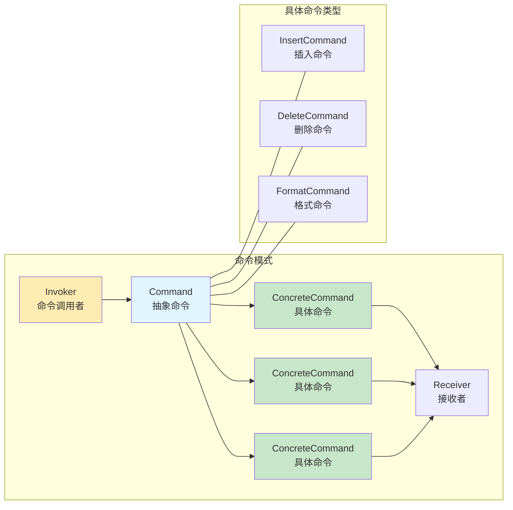
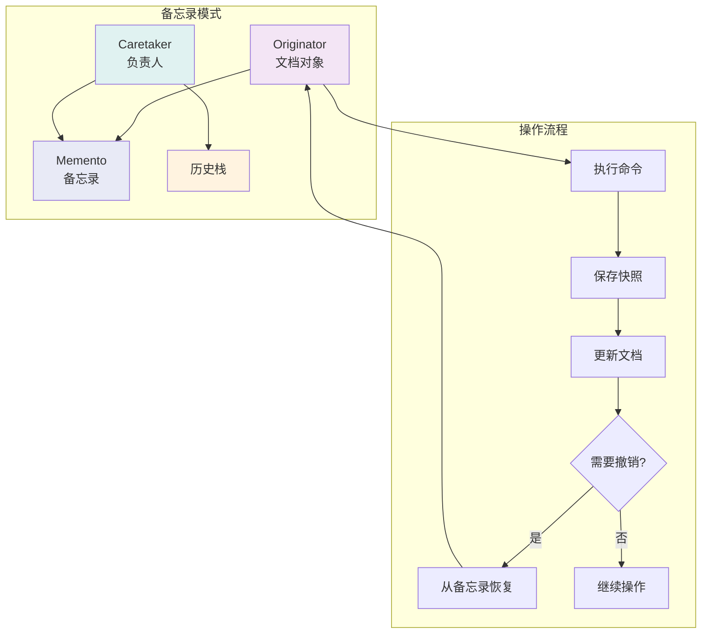
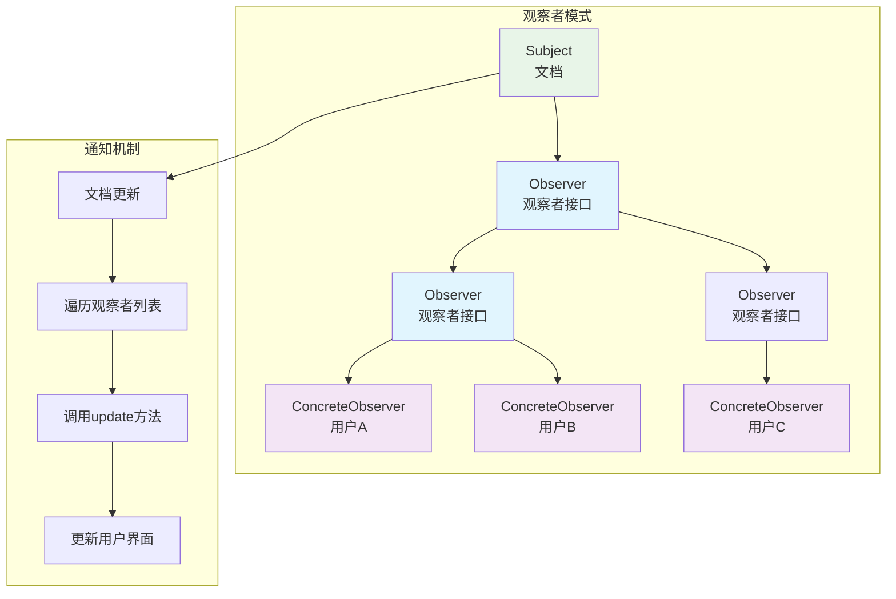
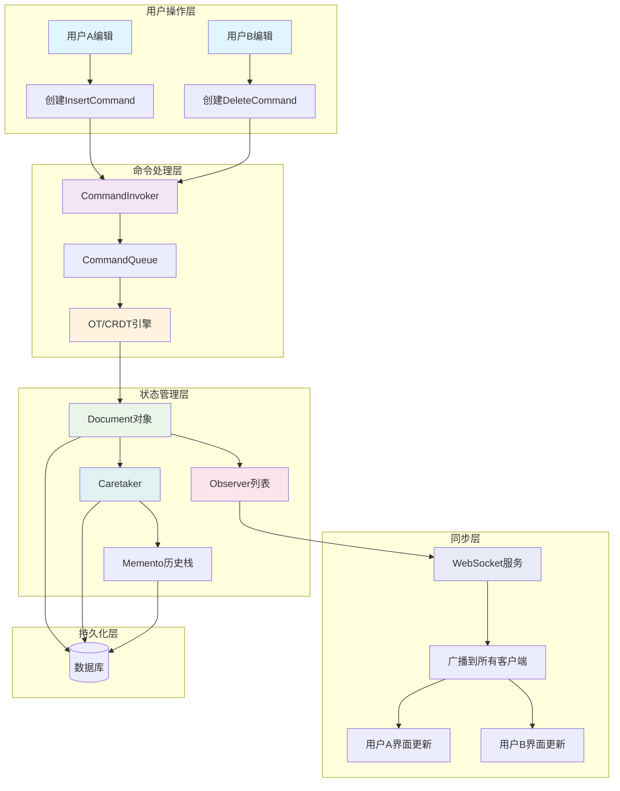
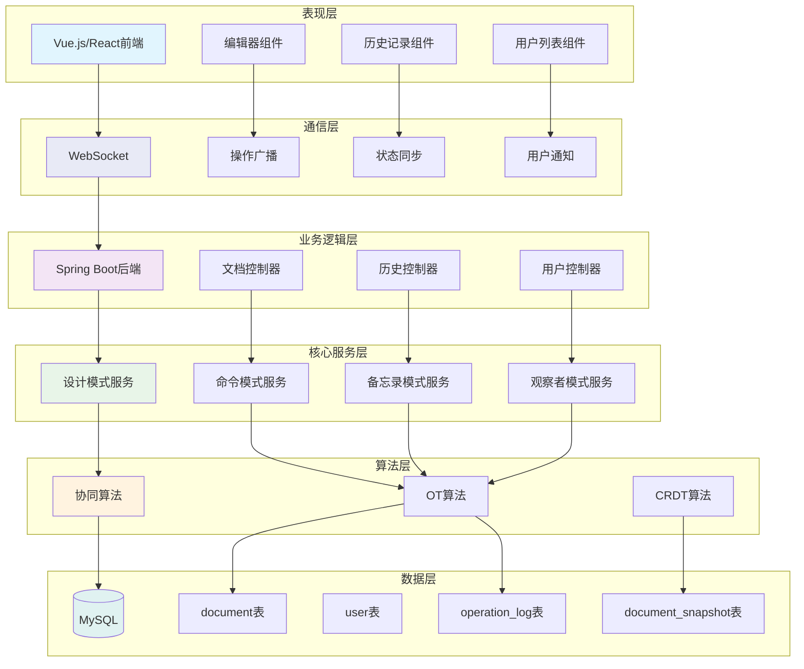
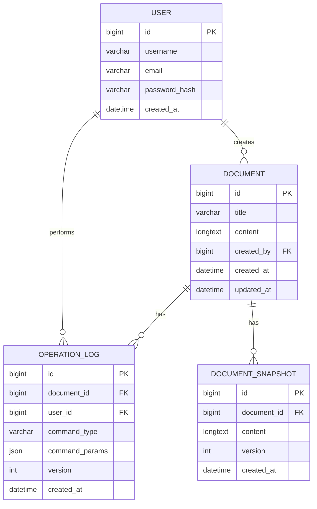
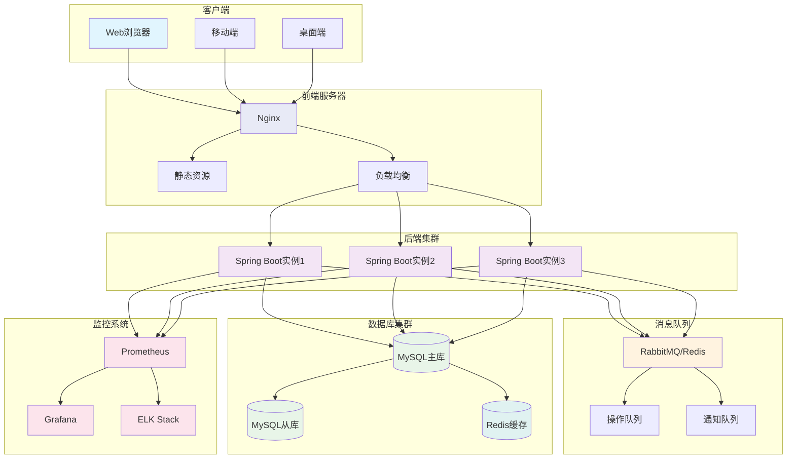

# 系统模式结构图

## 整体架构图

```mermaid
graph TB
    subgraph "前端层"
        A1[用户界面] --> A2[编辑器组件]
        A2 --> A3[WebSocket客户端]
    end
    
    subgraph "后端服务层"
        B1[WebSocket服务] --> B2[文档控制器]
        B2 --> B3[命令调度器]
        B3 --> B4[OT/CRDT引擎]
    end
    
    subgraph "数据层"
        C1[(MySQL)]
    end
    
    A3 <-->|WebSocket| B1
    B4 <--> C1
    
    style A1 fill:#e1f5fe
    style B3 fill:#f3e5f5
    style C1 fill:#e8f5e8
```

## 设计模式协作图

```mermaid
classDiagram
    class Command {
        <<interface>>
        +execute()
        +undo()
    }
    
    class InsertCommand {
        +execute()
        +undo()
    }
    
    class DeleteCommand {
        +execute()
        +undo()
    }
    
    class FormatCommand {
        +execute()
        +undo()
    }
    
    class Memento {
        -state: String
        -timestamp: DateTime
        +getState()
        +getTimestamp()
    }
    
    class Caretaker {
        -historyStack: Memento[]
        -currentIndex: int
        +saveState()
        +undo()
        +redo()
    }
    
    class Subject {
        <<interface>>
        +attach(observer)
        +detach(observer)
        +notify()
    }
    
    class Document {
        -content: String
        -observers: Observer[]
        +updateContent()
        +notifyAll()
    }
    
    class Observer {
        <<interface>>
        +update(document)
    }
    
    class Collaborator {
        -userId: String
        +update(document)
    }
    
    class CommandInvoker {
        -commandHistory: Command[]
        +executeCommand(command)
        +undoLastCommand()
        +redoLastCommand()
    }
    
    class DocumentController {
        -document: Document
        -caretaker: Caretaker
        -invoker: CommandInvoker
        +handleOperation()
        +syncToAll()
    }
    
    Command <|-- InsertCommand
    Command <|-- DeleteCommand
    Command <|-- FormatCommand
    Subject <|-- Document
    Observer <|-- Collaborator
    DocumentController --> Command
    DocumentController --> Memento
    DocumentController --> Subject
    DocumentController --> Caretaker
    DocumentController --> CommandInvoker
    Collaborator --> Observer
```

## 操作流程图

```mermaid
sequenceDiagram
    participant User as 用户
    participant Editor as 编辑器
    participant WS as WebSocket服务
    participant Cmd as 命令调度器
    participant Doc as 文档服务
    participant OT as OT引擎
    participant DB as 数据库
    participant Others as 其他用户
    
    User->>Editor: 输入编辑操作
    Editor->>WS: 发送操作请求
    WS->>Cmd: 转发操作
    Cmd->>Cmd: 创建命令对象
    Cmd->>Doc: 执行前保存快照
    Doc->>DB: 保存备忘录
    Cmd->>OT: 执行操作
    OT->>OT: 冲突检测与转换
    OT->>Doc: 更新文档状态
    Doc->>DB: 保存操作日志
    Doc->>WS: 通知所有观察者
    WS->>Others: 广播更新
    Others->>Editor: 同步更新
    Editor->>User: 显示最新内容
```

## 命令模式详细图

```mermaid
graph LR
    subgraph "命令模式"
        A[Invoker<br>命令调用者] --> B[Command<br>抽象命令]
        B --> C[ConcreteCommand<br>具体命令]
        B --> D[ConcreteCommand<br>具体命令]
        B --> E[ConcreteCommand<br>具体命令]
        C --> F[Receiver<br>接收者]
        D --> F
        E --> F
    end
    
    subgraph "具体命令类型"
        C1[InsertCommand<br>插入命令]
        C2[DeleteCommand<br>删除命令]
        C3[FormatCommand<br>格式命令]
    end
    
    B --- C1
    B --- C2
    B --- C3
    
    style A fill:#ffecb3
    style B fill:#e1f5fe
    style C fill:#c8e6c9
    style D fill:#c8e6c9
    style E fill:#c8e6c9
```

## 备忘录模式详细图

```mermaid
graph TB
    subgraph "备忘录模式"
        A[Originator<br>文档对象] --> B[Memento<br>备忘录]
        C[Caretaker<br>负责人] --> B
        C --> D[历史栈]
    end
    
    subgraph "操作流程"
        E[执行命令] --> F[保存快照]
        F --> G[更新文档]
        G --> H{需要撤销?}
        H -->|是| I[从备忘录恢复]
        H -->|否| J[继续操作]
    end
    
    A --> E
    I --> A
    
    style A fill:#f3e5f5
    style B fill:#e8eaf6
    style C fill:#e0f2f1
    style D fill:#fff3e0
```

## 观察者模式详细图

```mermaid
graph TB
    subgraph "观察者模式"
        A[Subject<br>文档] --> B[Observer<br>观察者接口]
        B --> C[Observer<br>观察者接口]
        B --> D[Observer<br>观察者接口]
        C --> E[ConcreteObserver<br>用户A]
        C --> F[ConcreteObserver<br>用户B]
        D --> G[ConcreteObserver<br>用户C]
    end
    
    subgraph "通知机制"
        H[文档更新] --> I[遍历观察者列表]
        I --> J[调用update方法]
        J --> K[更新用户界面]
    end
    
    A --> H
    
    style A fill:#e8f5e8
    style B fill:#e1f5fe
    style C fill:#e1f5fe
    style E fill:#f3e5f5
    style F fill:#f3e5f5
    style G fill:#f3e5f5
```

## 模式协作详细图

```mermaid
graph TB
    subgraph "用户操作层"
        A1[用户A编辑] --> B1[创建InsertCommand]
        A2[用户B编辑] --> B2[创建DeleteCommand]
    end
    
    subgraph "命令处理层"
        B1 --> C[CommandInvoker]
        B2 --> C
        C --> D[CommandQueue]
        D --> E[OT/CRDT引擎]
    end
    
    subgraph "状态管理层"
        E --> F[Document对象]
        F --> G[Caretaker]
        G --> H[Memento历史栈]
        F --> I[Observer列表]
    end
    
    subgraph "同步层"
        I --> J[WebSocket服务]
        J --> K[广播到所有客户端]
        K --> L[用户A界面更新]
        K --> M[用户B界面更新]
    end
    
    subgraph "持久化层"
        F --> N[(数据库)]
        G --> N
        H --> N
    end
    
    style A1 fill:#e1f5fe
    style A2 fill:#e1f5fe
    style C fill:#f3e5f5
    style E fill:#fff3e0
    style F fill:#e8f5e8
    style G fill:#e0f2f1
    style I fill:#fce4ec
    style J fill:#e8eaf6
```

## 技术架构图

```mermaid
graph TB
    subgraph "表现层"
        A[Vue.js/React前端]
        A1[编辑器组件]
        A2[用户列表组件]
        A3[历史记录组件]
    end
    
    subgraph "通信层"
        B[WebSocket]
        B1[操作广播]
        B2[状态同步]
        B3[用户通知]
    end
    
    subgraph "业务逻辑层"
        C[Spring Boot后端]
        C1[文档控制器]
        C2[用户控制器]
        C3[历史控制器]
    end
    
    subgraph "核心服务层"
        D[设计模式服务]
        D1[命令模式服务]
        D2[备忘录模式服务]
        D3[观察者模式服务]
    end
    
    subgraph "算法层"
        E[协同算法]
        E1[OT算法]
        E2[CRDT算法]
    end
    
    subgraph "数据层"
        F[(MySQL)]
        F1[document表]
        F2[user表]
        F3[operation_log表]
        F4[document_snapshot表]
    end
    
    A --> B
    B --> C
    C --> D
    D --> E
    E --> F
    
    A1 --> B1
    A2 --> B3
    A3 --> B2
    
    C1 --> D1
    C2 --> D3
    C3 --> D2
    
    D1 --> E1
    D2 --> E1
    D3 --> E1
    
    E1 --> F1
    E1 --> F3
    E2 --> F4
    
    style A fill:#e1f5fe
    style B fill:#e8eaf6
    style C fill:#f3e5f5
    style D fill:#e8f5e8
    style E fill:#fff3e0
    style F fill:#e0f2f1
```

## 数据库ER图

```mermaid
erDiagram
    USER ||--o{ DOCUMENT : creates
    USER ||--o{ OPERATION_LOG : performs
    DOCUMENT ||--o{ OPERATION_LOG : has
    DOCUMENT ||--o{ DOCUMENT_SNAPSHOT : has
    DOCUMENT {
        bigint id PK
        varchar title
        longtext content
        bigint created_by FK
        datetime created_at
        datetime updated_at
    }
    USER {
        bigint id PK
        varchar username
        varchar email
        varchar password_hash
        datetime created_at
    }
    OPERATION_LOG {
        bigint id PK
        bigint document_id FK
        bigint user_id FK
        varchar command_type
        json command_params
        int version
        datetime created_at
    }
    DOCUMENT_SNAPSHOT {
        bigint id PK
        bigint document_id FK
        longtext content
        int version
        datetime created_at
    }
```

## 部署架构图

```mermaid
graph TB
    subgraph "客户端"
        A[Web浏览器]
        A1[移动端]
        A2[桌面端]
    end
    
    subgraph "前端服务器"
        B[Nginx]
        B1[静态资源]
        B2[负载均衡]
    end
    
    subgraph "后端集群"
        C[Spring Boot实例1]
        D[Spring Boot实例2]
        E[Spring Boot实例3]
    end
    
    subgraph "消息队列"
        F[RabbitMQ/Redis]
        F1[操作队列]
        F2[通知队列]
    end
    
    subgraph "数据库集群"
        G[(MySQL主库)]
        H[(MySQL从库)]
        I[(Redis缓存)]
    end
    
    subgraph "监控系统"
        J[Prometheus]
        K[Grafana]
        L[ELK Stack]
    end
    
    A --> B
    A1 --> B
    A2 --> B
    B --> B1
    B --> B2
    B2 --> C
    B2 --> D
    B2 --> E
    
    C --> F
    D --> F
    E --> F
    F --> F1
    F --> F2
    
    C --> G
    D --> G
    E --> G
    G --> H
    G --> I
    
    C --> J
    D --> J
    E --> J
    J --> K
    J --> L
    
    style A fill:#e1f5fe
    style B fill:#e8eaf6
    style C fill:#f3e5f5
    style D fill:#f3e5f5
    style E fill:#f3e5f5
    style F fill:#fff3e0
    style G fill:#e8f5e8
    style H fill:#e8f5e8
    style I fill:#e0f2f1
    style J fill:#fce4ec
    style K fill:#fce4ec
    style L fill:#fce4ec
```
