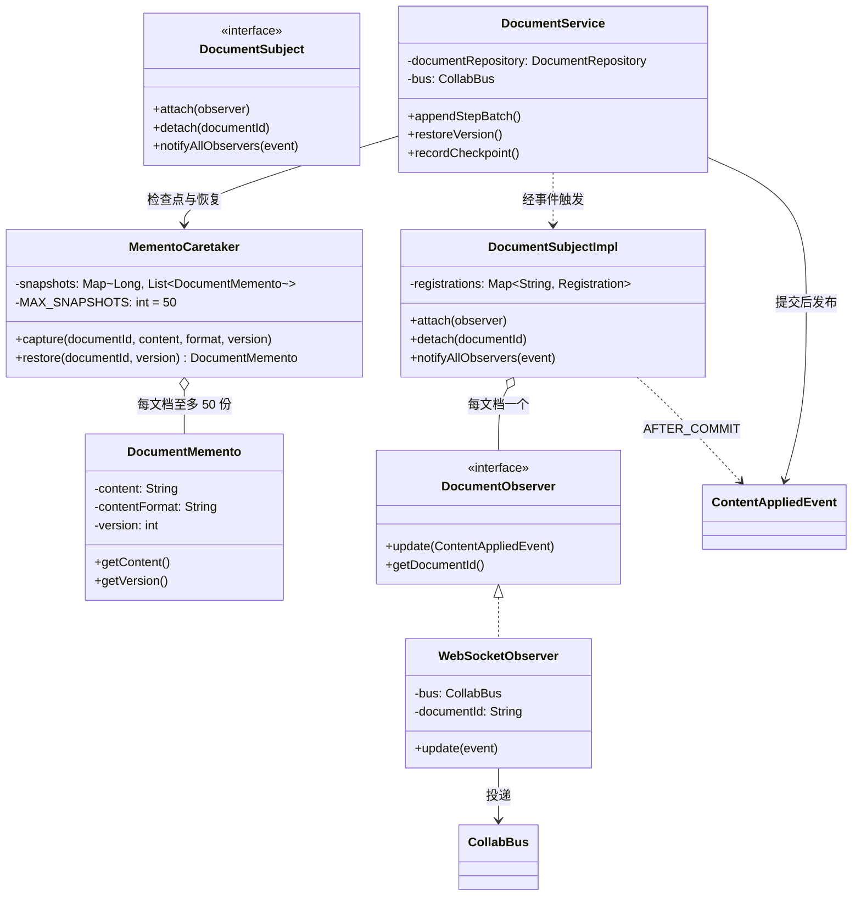
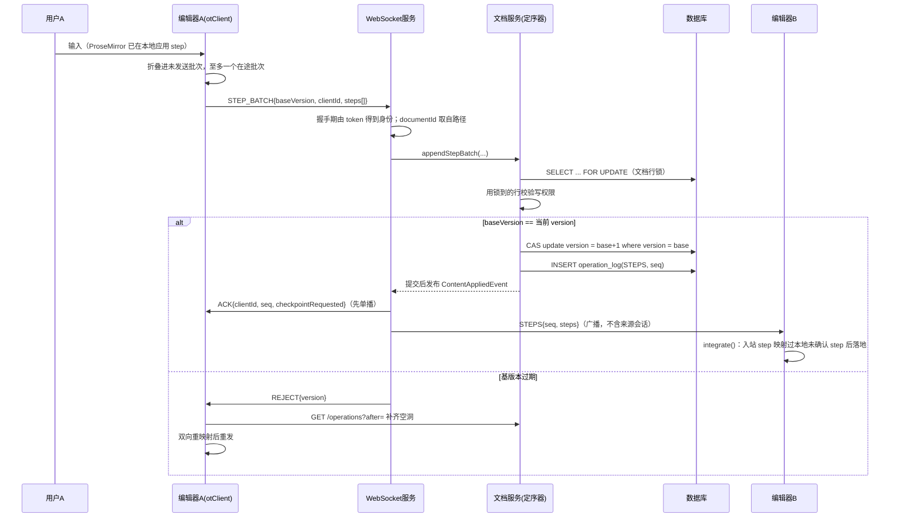
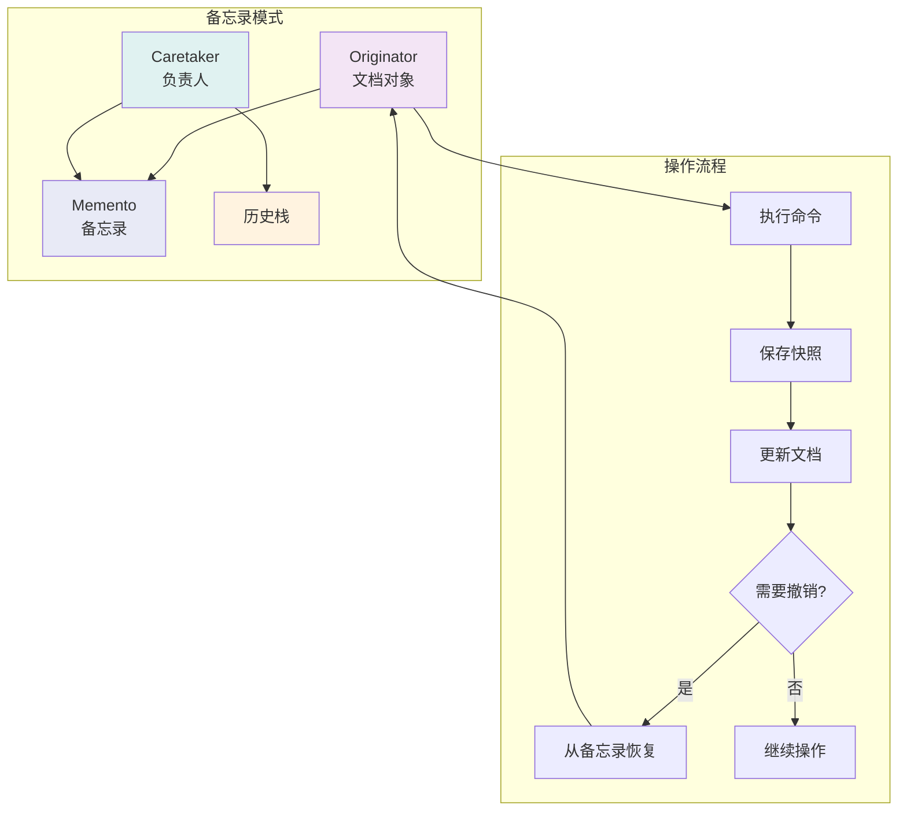
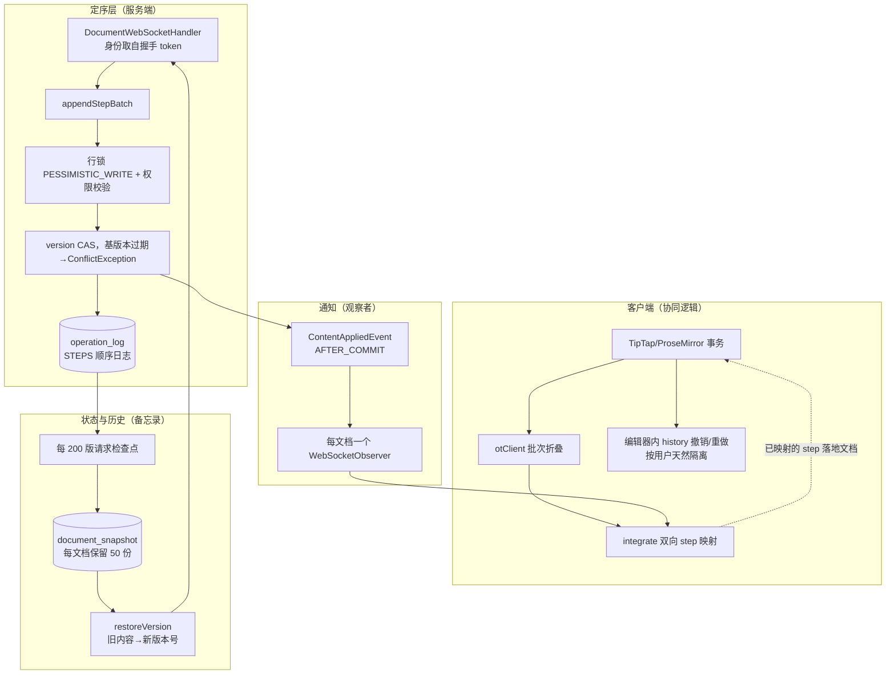
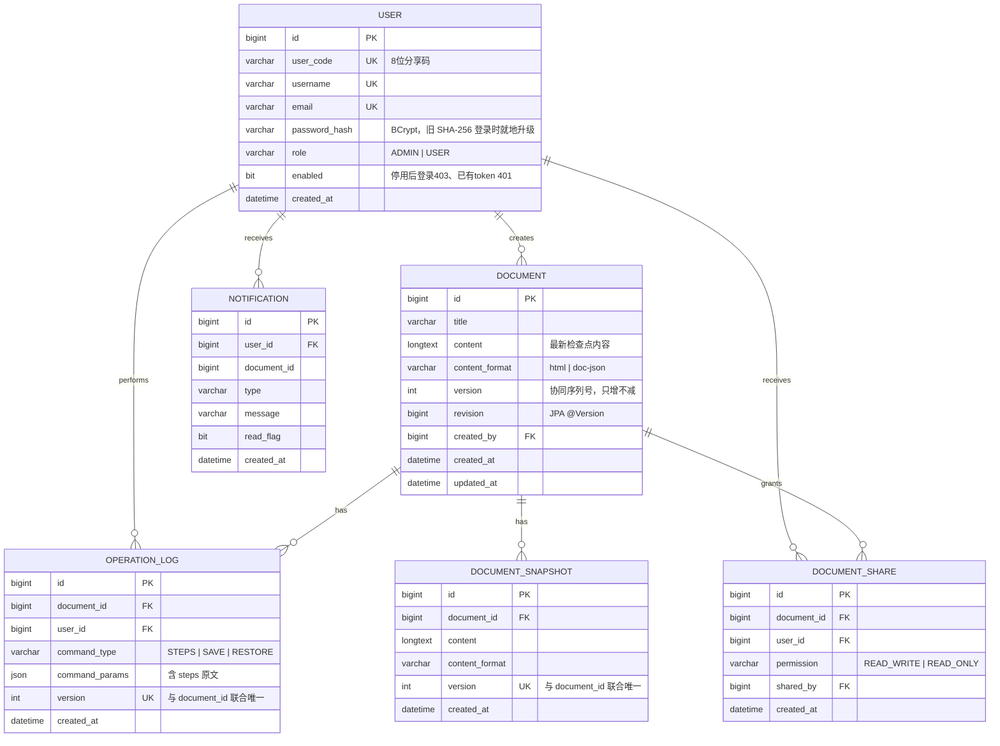
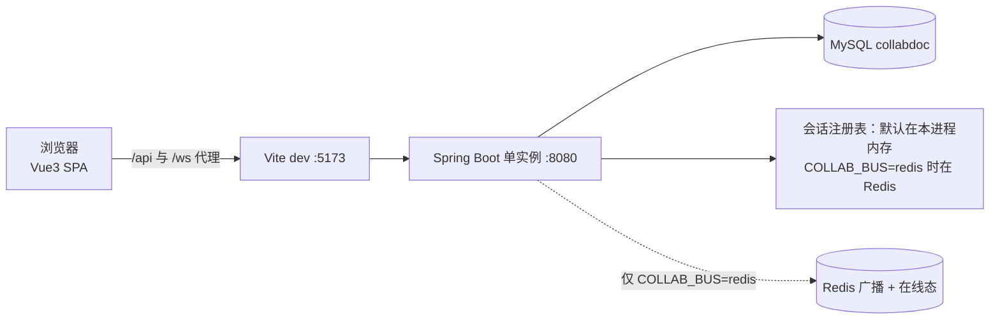
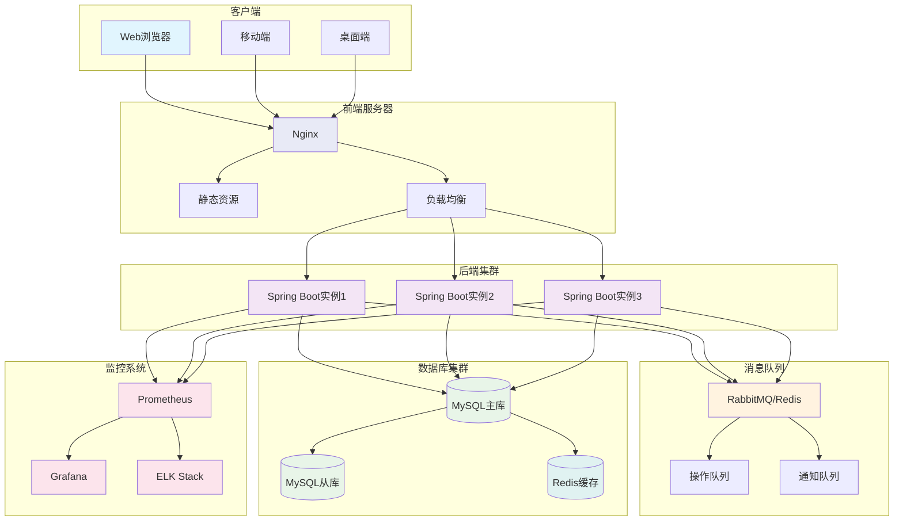

# 系统模式结构图

## 整体架构图

```mermaid
graph TB
    subgraph "前端层"
        A1[用户界面] --> A2[编辑器组件]
        A2 --> A3[WebSocket客户端]
    end
    
    subgraph "后端服务层"
        B1[DocumentWebSocketHandler<br>身份来自握手 token] --> B2[DocumentService<br>定序器]
        B0[REST 控制器<br>文档/用户/通知/管理] --> B2
        B2 --> B3[行锁 PESSIMISTIC_WRITE<br>+ version CAS]
        B2 --> B4[CollabBus<br>memory 或 redis]
    end
    
    subgraph "数据层"
        C1[(MySQL<br>document / operation_log / document_snapshot)]
        C2[(Redis<br>仅 COLLAB_BUS=redis)]
    end
    
    A3 <-->|WebSocket| B1
    A2 <-->|REST| B0
    B3 --> C1
    B4 -.-> C2
    B4 -->|本节点投递| A3
    
    style A1 fill:#e1f5fe
    style B2 fill:#f3e5f5
    style C1 fill:#e8f5e8
```



服务端不解释文档内容：客户端发不透明的 ProseMirror step 批次，服务端只负责排序与鉴权，合流由客户端
`otClient.js` 完成。图中没有"命令调度器"和"OT/CRDT 引擎"，因为这两层从未实现为服务端组件
（理由见设计文档）。

## 设计模式协作图



实现说明：`DocumentService.restoreVersion` 是备忘录模式的真实调用方；编辑器内的撤销/重做是前端
ProseMirror history，不经过服务端。`pattern/memento`、`pattern/observer` 是仅存的两个模式包 ——
原先的 `pattern/command` 与 `ot/` 已删除，因为服务端不解释文档内容，命令式的插入/删除没有落点。

## 操作流程图

对应实现：`DocEditor.vue` → `collab/otClient.js` → `DocumentWebSocketHandler` → `DocumentService.appendStepBatch`。
服务端不解释文档内容，只负责定序；一致性由客户端的 step 映射保证。



每 `CHECKPOINT_EVERY`（200）个版本，`ACK.checkpointRequested` 让已确认的客户端上传整篇 doc JSON 到
`POST /{id}/checkpoint`，服务端落 `document_snapshot` 并折叠其下方的日志。新加入或重连的客户端拿到的
是"最新检查点内容 + `checkpointVersion`"，再重放其上的日志才能追平。

## 备忘录模式详细图



## 观察者模式详细图

一个文档只有**一个** `WebSocketObserver`（按文档引用计数挂/摘，会话数不直接对应观察者数），因此一次变更
只会产生一条广播，而不是"会话数 × 会话数"。发送者按会话排除（不是按用户），同一账号开两个标签页仍会收到。

```mermaid
graph TB
    subgraph "服务端"
        S1[DocumentService<br>提交事务后发布 ContentAppliedEvent]
        S2[DocumentSubjectImpl<br>@TransactionalEventListener AFTER_COMMIT]
        S3[WebSocketObserver<br>每文档一个]
        S4[WebSocketSessionManager<br>ConcurrentWebSocketSessionDecorator]
    end

    subgraph "会话"
        C1[用户A 会话1]
        C2[用户A 会话2]
        C3[用户B 会话1]
    end

    S1 --> S2 --> S3 --> S4
    S4 -->|本节点投递·排除来源会话| C2
    S4 --> C3
    S4 -.->|ACK 单发给来源| C1
```

事务回滚时监听器不触发，未提交的内容不会到达任何客户端；并发写之间帧序不保证，因此**每一帧都带 seq**，
客户端靠序列空洞检测回补。

## 模式协作详细图



注：图中的"命令"角色由客户端的 step 批次承担，服务端不解释内容。原 `pattern/command` 与 `ot/` 已删除
（理由见设计文档"为什么不用字符偏移 OT 处理富文本"）。

## 技术架构图

```mermaid
graph TB
    subgraph "表现层"
        A[Vue 3 + Vite SPA]
        A1[TipTap 编辑器组件]
        A2[协同客户端 otClient]
        A3[历史记录/分享面板]
    end
    
    subgraph "通信层"
        B[WebSocket /ws/document/&#123;id&#125;]
        B1[STEP_BATCH 上行]
        B2[STEPS/ACK/REJECT/RESET 下行]
        B3[CURSOR_UPDATE 与 NOTIFICATION]
    end
    
    subgraph "业务逻辑层"
        C[Spring Boot后端]
        C1[文档控制器]
        C2[用户控制器]
        C3[通知与管理控制器]
    end
    
    subgraph "核心服务层"
        D[领域服务]
        D1[DocumentService<br>定序：行锁 + version CAS]
        D2[MementoCaretaker<br>检查点，保留 50 份]
        D3[DocumentSubject<br>每文档一个观察者]
    end
    
    subgraph "一致性策略"
        E[协同一致性]
        E1[服务端定序 + 客户端双向 step 映射]
        E2[CRDT 为演进方向，未实现]
    end
    
    subgraph "数据层"
        F[(MySQL)]
        F1[document表]
        F2[user表]
        F3[operation_log表]
        F4[document_snapshot表]
    end
    
    A --> B
    B --> C
    C --> D
    D --> E
    E --> F
    
    A1 --> B1
    A2 --> B3
    A3 --> B2
    
    C1 --> D1
    C2 --> D3
    C3 --> D2
    
    D1 --> E1
    D2 --> E1
    D3 --> E1
    
    E1 --> F1
    E1 --> F3
    E2 --> F4
    
    style A fill:#e1f5fe
    style B fill:#e8eaf6
    style C fill:#f3e5f5
    style D fill:#e8f5e8
    style E fill:#fff3e0
    style F fill:#e0f2f1
```



## 数据库ER图



`(document_id, version)` 在两张子表上都是唯一约束：它是"序列号不会被铸造两次"这条不变量的数据库级保证。

## 部署架构图

### 当前实际拓扑（可运行）



广播与在线态已经抽象成 `CollabBus`：默认实现 `LocalCollabBus` 只看得见本进程的 socket；`COLLAB_BUS=redis`
时换成 `RedisCollabBus`，帧经 `collab:frames` 发给所有节点、成员表放在 Redis 并由各节点心跳续租，这样在
node A 定序出来的内容才能到达挂在 node B 上的浏览器。**这条外置路径只有代码，没跑过双实例实测**（本机起
Docker Desktop 会触发校园网认证的多网卡拦截，详见 `AGENTS.md`）。

**定序本身一直是集群安全的**：序列号由数据库行锁 + `where version = :base` 的 CAS 铸造，不依赖任何进程内
状态；编辑器内的撤销/重做是前端 ProseMirror history，按用户天然隔离。所以多实例缺的从来不是并发正确性，
而是投递。检查点历史（`document_snapshot`）本来就在数据库里，跨重启与跨实例都成立。

### 目标拓扑（尚未实现，勿当作现状）

下图的消息队列、MySQL 主从、Nginx 负载均衡与 Prometheus/Grafana/ELK 监控均为规划项，`backend/pom.xml`
中没有对应依赖与配置。Redis 是唯一已经落地的：`spring-boot-starter-data-redis` 已引入，用于上面那条
`COLLAB_BUS=redis` 的广播总线；图中的"Redis 缓存"（内容缓存）仍属规划。


